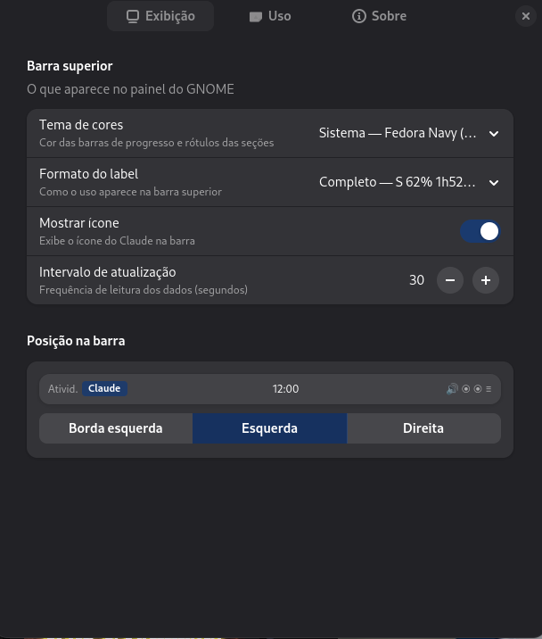
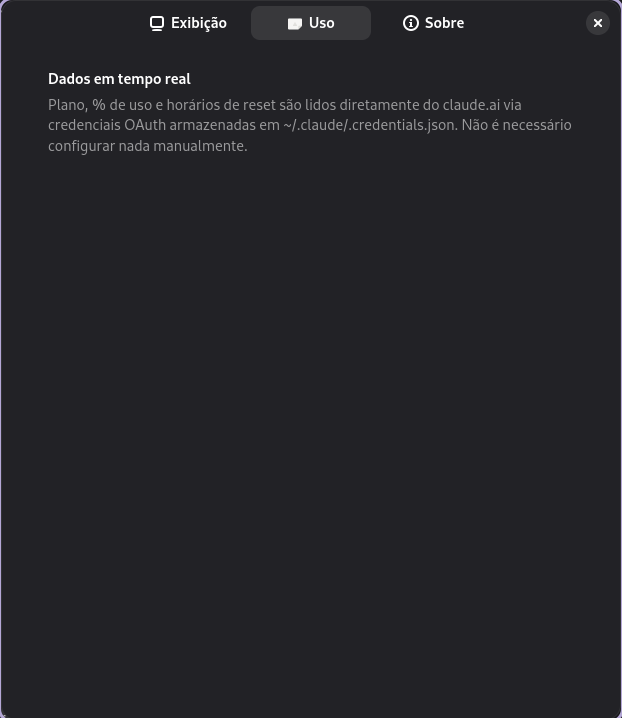
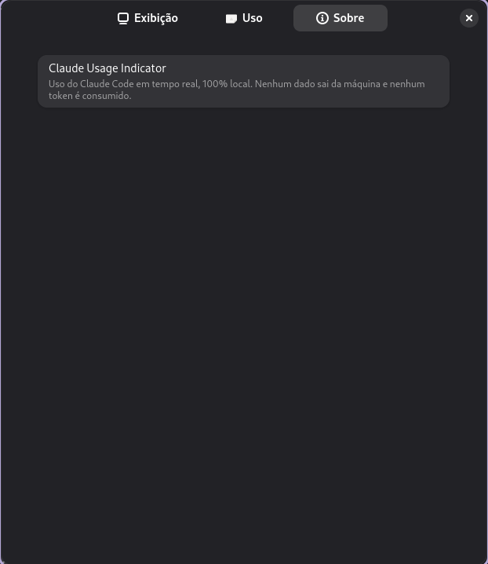

# Claude Usage Indicator

Uma extensão do **GNOME Shell** que mostra o uso do **Claude Code** em tempo
real na barra superior: porcentagem da sessão de 5h, uso de hoje e da semana.
Ao clicar, abre um painel com estatísticas detalhadas.

> **100% local.** Lê os arquivos de transcrição que o Claude Code já grava em
> `~/.claude/projects/` e as credenciais OAuth em `~/.claude/.credentials.json`.
> Nenhum dado sai da máquina e nenhum token é consumido.

---

## Formatos do label na barra superior

Escolha o formato que prefere nas preferências da extensão:

| Formato | Preview |
|---|---|
| **Completo** — percentual + countdown |  |
| **Compacto** — só percentual |  |
| **Barras** — ícones de progresso |  |

---

## Preferências

<table>
<tr>
<td><b>Exibição</b> — tema, formato do label, posição na barra, ícone, intervalo</td>
<td><b>Uso</b> — dados em tempo real via OAuth</td>
<td><b>Sobre</b></td>
</tr>
<tr>
<td></td>
<td></td>
<td></td>
</tr>
</table>

---

## Posição na barra

Escolha onde o indicador aparece nas preferências da extensão:

| Opção | Descrição |
|---|---|
| **Direita (padrão)** | Lado direito, próximo ao centro |
| **Direita — 1° da borda direita** | Primeiro elemento entrando pela borda direita |
| **Esquerda** | Lado esquerdo (após o botão Atividades) |
| **Esquerda — 1° da borda esquerda** | Antes do botão Atividades, na extremidade esquerda |

A posição é aplicada ao vivo ao mudar nas preferências — sem precisar reiniciar a extensão.

---

## Temas de cores

As barras de progresso e os rótulos se adaptam ao tema escolhido:

| Tema | Cor principal | Indicado para |
|---|---|---|
| **Automático** | `accent color` do sistema (GNOME 47+) | Qualquer distro |
| **Sistema — Fedora Navy** | `#163570` (azul marinho) | Fedora / GNOME padrão |
| **Catppuccin Macchiato** | `#8aadf4` (azul suave) | Catppuccin |
| **Verde GNOME** | `#26a269` (verde) | GNOME verde |
| **Laranja Ubuntu** | `#e95420` (laranja) | Ubuntu |

---

## Recursos

- **Painel compacto** na barra superior com percentual real de uso (S/H/W) —
  sessão de 5h · hoje · semana — com countdown até o reset.
- **Dados reais da Anthropic**: % de uso e horários de reset lidos diretamente
  da API do claude.ai via OAuth, sem precisar configurar nada.
- **Popup detalhado** com sessão de 5h (janela rolante), uso de hoje, uso da
  semana e quebra por modelo (Opus / Sonnet / Haiku).
- **Barras de progresso** que mudam de cor (verde → amarelo → vermelho)
  conforme você se aproxima do limite.
- **Plano detectado automaticamente** (Pro / Max) a partir das credenciais OAuth.
- **Estimativa de custo** pelos preços públicos da API por modelo.

---

## Requisitos

- GNOME Shell 45–50
- `python3`
- Claude Code instalado e em uso (é a fonte dos dados)

---

## Instalação

```bash
git clone https://github.com/eltobsjr/claude-usage-indicator.git
cd claude-usage-indicator
./install.sh
gnome-extensions enable claude-usage@eltobsjr.gmail.com
```

No **Wayland** é preciso fazer **logout/login** após instalar para o GNOME Shell
recarregar as extensões. No **X11**, basta `Alt+F2` → `r` → Enter.

### Via Makefile

```bash
make install   # copia e compila o schema
make enable    # ativa a extensão
make run       # roda o tracker e imprime o resumo no terminal
make pack      # gera o .zip para o extensions.gnome.org
```

---

## Configuração

Abra as preferências em:

```bash
gnome-extensions prefs claude-usage@eltobsjr.gmail.com
```

Ou pelo menu da extensão → **Preferências**.

- **Exibição** — tema de cores, formato do label, posição na barra, mostrar/ocultar ícone,
  intervalo de atualização.
- **Uso** — informativo: os dados de plano e % de uso vêm automaticamente das
  credenciais OAuth do Claude Code, sem configuração manual.

---

## Como funciona

O Claude Code grava cada sessão em arquivos `JSONL` dentro de
`~/.claude/projects/`. A extensão dispara um pequeno script Python
(`claude-usage-tracker.py`) que:

1. Lê esses arquivos com cache incremental por `mtime`,
2. Deduplica por `messageId:requestId`,
3. Agrega por janela de 5h, dia e semana,
4. Busca **% de uso real e horários de reset** via `GET /api/oauth/usage` do
   claude.ai, usando o token OAuth de `~/.claude/.credentials.json`,
5. Estima o custo pelos preços públicos por modelo,
6. Grava um resumo em `~/.local/share/claude-usage/usage.json`.

A extensão lê esse JSON e desenha a interface — sem nenhuma chamada de rede
adicional e sem consumir tokens.

Você também pode usar o tracker sozinho, sem a extensão:

```bash
python3 extension/claude-usage-tracker.py --print
python3 extension/claude-usage-tracker.py --watch 30   # loop a cada 30s
```

---

## Estrutura

```
claude-usage-indicator/
├── extension/
│   ├── extension.js                 # UI do painel + popup
│   ├── prefs.js                     # preferências (libadwaita)
│   ├── metadata.json
│   ├── stylesheet.css               # estilo adaptável ao tema
│   ├── claude-usage-tracker.py      # parser dos JSONL + consulta OAuth
│   ├── icons/claude-symbolic.svg
│   └── schemas/*.gschema.xml
├── docs/                            # screenshots
├── install.sh
├── Makefile
├── LICENSE
└── README.md
```

---

## Notas

- Os **custos são estimativas** baseadas nos preços públicos da API. Planos de
  assinatura (Pro/Max) têm faturamento diferente — use como referência relativa.
- A **% de uso** da sessão e da semana vem diretamente da Anthropic via OAuth.
  O "hoje" não tem equivalente na API, então exibe tokens e custo sem percentual.

---

## Licença

MIT — veja [LICENSE](LICENSE).
